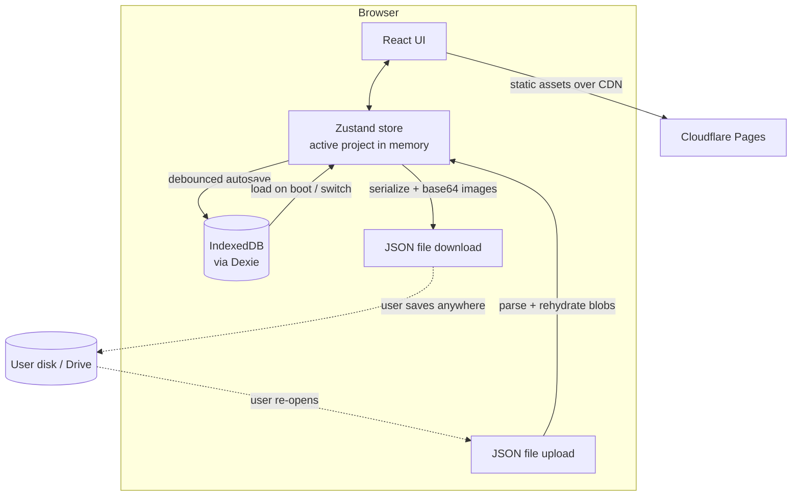
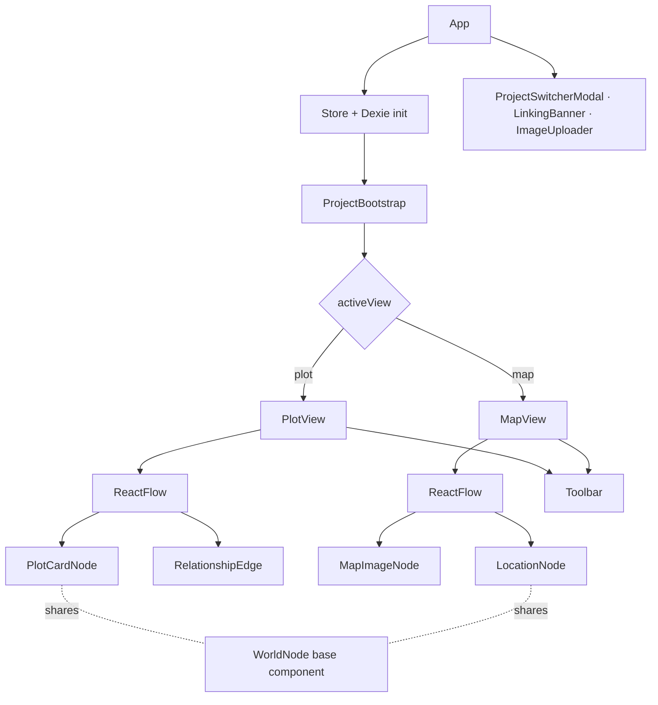
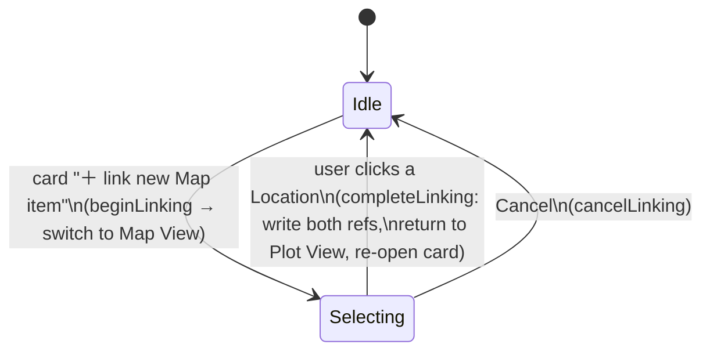

# Architecture — Plot & Map (working title)

> A browser-based worldbuilding / story-planning tool. Two canvases — **Plot View** (event & character cards joined by relationship lines) and **Map View** (location markers over an uploaded map image) — that cross-reference each other. No backend, no accounts: all data lives in the user's browser, with manual JSON export/import for portability.

---

## 1. Tech stack (locked)

| Concern | Choice | Notes |
|---|---|---|
| Framework | **React 18** | SPA, no SSR needed |
| Build tool | **Vite** | Fast dev server, simple static build for Cloudflare Pages |
| Language | **TypeScript** | *Recommended* — the data model is reference-heavy; types prevent whole classes of bugs. See open question Q6. |
| Canvas | **@xyflow/react** (react-flow v12) | Draggable nodes, pan/zoom, custom nodes & edges. Used for **both** views. |
| State | **Zustand** | Single source of truth; react-flow already uses it internally, so it composes cleanly. |
| Persistence | **IndexedDB via Dexie.js** | Autosave layer. Images stored as `Blob`s, not base64. |
| Portability | **Manual JSON export/import** | The "Save" button. Images inlined as base64 in the export file. |
| Styling | **Tailwind CSS** *(suggested)* | Flexible; swap for CSS Modules if preferred. |
| Host | **Cloudflare Pages** | Git-push deploy. Needs SPA fallback config. |

---

## 2. System overview



There is **no application server**. Cloudflare Pages only serves static files (HTML/JS/CSS). Everything stateful happens client-side.

---

## 3. Data model

A **Project** is the whole serializable unit. Both views live inside it. This single shape drives autosave, export, and import.

```ts
// schemaVersion lets future migrations transform old saved/exported projects.
const SCHEMA_VERSION = 1;

interface Project {
  id: string;            // uuid
  name: string;
  schemaVersion: number;
  createdAt: string;     // ISO
  updatedAt: string;     // ISO
  plot: PlotView;
  map: MapView;
}

interface PlotView {
  cards: PlotCard[];
  links: RelationshipLink[];
  viewport: Viewport;    // { x, y, zoom } — restores pan/zoom
}

interface MapView {
  background: ImageRef | null;   // the uploaded map image
  locations: Location[];
  viewport: Viewport;
}

// PlotCard and Location are intentionally the SAME shape (a "WorldNode"),
// differing only by which list of cross-refs they hold. Share one component.
interface WorldNodeBase {
  id: string;
  title: string;             // editable, "" by default
  image: ImageRef | null;    // editable, null by default
  description: string;       // shown when expanded
  position: { x: number; y: number };
}

interface PlotCard extends WorldNodeBase {
  mapRefs: string[];         // Location ids referenced from this card
}

interface Location extends WorldNodeBase {
  plotRefs: string[];        // PlotCard ids referenced from this marker
}

// Relationship line between two plot cards (a react-flow edge).
interface RelationshipLink {
  id: string;
  source: string;            // PlotCard id
  target: string;            // PlotCard id
  description: string;       // editable, shown when the line is clicked
}

interface ImageRef {
  blobId: string;            // key into the `blobs` IndexedDB store
  width: number;
  height: number;
  mime: string;
}

interface Viewport { x: number; y: number; zoom: number; }
```

### Cross-reference rule (important — see open question Q1)
The **default assumption** in this architecture is that a Plot Card ↔ Location reference is **one bidirectional relationship**. Linking card *C* to location *L* writes `L` into `C.mapRefs` **and** `C` into `L.plotRefs` in the same action. Removing it clears both sides. This keeps the two bullet lists from drifting out of sync. (If you instead want two independent one-way lists, that's a small change — flagged in the plan.)

### Referential integrity
- Deleting a **PlotCard** must: remove its `RelationshipLink`s, and pull its id from every `Location.plotRefs`.
- Deleting a **Location** must: pull its id from every `PlotCard.mapRefs`.
- All mutations go through store actions (below) so this cleanup happens in exactly one place.

---

## 4. State management (Zustand)

One store holds the **in-memory active project** plus transient UI state. react-flow is driven *from* this store (controlled nodes/edges) so that autosave and cross-view logic have a single source of truth.

```ts
interface AppState {
  // --- persisted (mirrored to IndexedDB) ---
  project: Project | null;

  // --- transient UI state (NOT persisted) ---
  activeView: 'plot' | 'map';
  focusedNodeId: string | null;      // node to scroll-to/open after a cross-view jump
  expandedNodeId: string | null;     // which card/location is expanded
  selectedLinkId: string | null;     // which relationship line's editor is open
  linking: LinkingContext | null;    // cross-view "selection mode", null when inactive

  // --- project lifecycle ---
  newProject(name: string): Promise<void>;
  switchProject(id: string): Promise<void>;
  listProjects(): Promise<ProjectMeta[]>;
  exportProject(): Promise<void>;     // → triggers JSON download
  importProject(file: File): Promise<void>;

  // --- plot mutations ---
  addPlotCard(): void;
  updatePlotCard(id: string, patch: Partial<PlotCard>): void;
  removePlotCard(id: string): void;
  addLink(source: string, target: string): void;
  updateLink(id: string, patch: Partial<RelationshipLink>): void;
  removeLink(id: string): void;

  // --- map mutations ---
  setBackgroundImage(file: File): Promise<void>;
  addLocation(): void;
  updateLocation(id: string, patch: Partial<Location>): void;
  removeLocation(id: string): void;

  // --- cross-view linking ---
  beginLinking(ctx: LinkingContext): void;   // enters selection mode + switches view
  completeLinking(targetId: string): void;    // writes both sides of the ref
  cancelLinking(): void;
  addCrossRef(cardId: string, locationId: string): void;
  removeCrossRef(cardId: string, locationId: string): void;

  // --- navigation ---
  goTo(view: 'plot' | 'map', focusNodeId?: string): void;
}

interface LinkingContext {
  // we're linking FROM this node, and need the user to pick a node in the other view
  sourceView: 'plot' | 'map';
  sourceId: string;
}
```

Any action that mutates `project` also bumps `project.updatedAt` and schedules a debounced autosave (Section 5).

---

## 5. Persistence layer

### 5.1 IndexedDB schema (Dexie)
```ts
// db.ts
class AppDB extends Dexie {
  projects!: Table<Project, string>;   // full project objects, keyed by id
  blobs!: Table<{ id: string; data: Blob }, string>;  // images, keyed by blobId
  meta!: Table<{ key: string; value: any }, string>;  // e.g. lastActiveProjectId
}
db.version(1).stores({
  projects: 'id, name, updatedAt',
  blobs: 'id',
  meta: 'key',
});
```
- **Images are `Blob`s** in the `blobs` store, referenced by `ImageRef.blobId`. The UI displays them via `URL.createObjectURL(blob)` (revoke object URLs on unmount to avoid leaks).
- **Autosave**: a debounced (~600ms) write of the whole active `project` to `projects`. Simple and robust for MVP; optimize to per-entity writes only if it ever feels slow.
- **Boot**: read `meta.lastActiveProjectId` → load that project → if none exists, show the "create your first project" state.

### 5.2 Export (the manual "Save" button)
1. Deep-clone the active `project`.
2. For every `ImageRef`, read its `Blob` from `blobs` and replace the ref with an inline base64 string in the exported JSON.
3. Wrap as `{ schemaVersion, exportedAt, project }` and trigger a download (`<a download>` + object URL), filename `${project.name}.json`.

### 5.3 Import
1. Read file → `JSON.parse`.
2. Validate `schemaVersion`; run migrations if older.
3. For every inline base64 image, decode to a `Blob`, store it in `blobs` with a fresh `blobId`, and rewrite the `ImageRef`.
4. Assign a new project `id` (avoid clobbering an existing project), persist, and switch to it.

> **Tradeoff (open question Q3):** inlining images as base64 makes a single self-contained file (easy to email/Drive) but inflates size ~33%. Alternative is a `.zip` (JSON + image files) — more work, smaller. MVP uses base64.

---

## 6. View rendering with react-flow

Both views are react-flow instances driven by the store.

### Plot View
- `nodeTypes = { plotCard: PlotCardNode }` — custom node renders collapsed/expanded states (wireframe 02).
- `edgeTypes = { relationship: RelationshipEdge }` — custom edge with a clickable hit-area and a description editor popover (wireframe 03).
- The chain-link button on a card calls `beginLinking`-style logic but **same-view**: it enters a "pick a target card" mode; the next card clicked becomes the edge target → `addLink`.

### Map View
- `nodeTypes = { mapImage: MapImageNode, location: LocationNode }`.
- **`MapImageNode`** is a single non-draggable, non-selectable node at the bottom z-order positioned at the flow origin; its size = the image's natural dimensions. This makes the map pan/zoom together with the markers in one coordinate space.
- **`LocationNode`** reuses the same collapsed/expanded component as `PlotCardNode` (shared `WorldNode`), styled as a pin.
- No edges in Map View (locations don't connect to each other).

### Shared Toolbar
One `<Toolbar>` component, floating left, rendered in both views. It takes the `activeView` and renders the correct **bottom section** tools; the **top section** (new / switch / save) is identical in both.



---

## 7. Cross-view linking — state machine

The trickiest interaction. It must survive a **view switch** mid-flow, so the "what am I linking from" lives in store state (`linking`), not component state.



While `linking !== null`, the target view renders a **selection banner** (wireframe 05), highlights candidate nodes, and routes node clicks to `completeLinking` instead of normal selection. The symmetric flow exists from a Location linking to a Plot Card.

**Navigation (not linking):** clicking an existing bullet ref calls `goTo(otherView, refId)`, which sets `activeView` + `focusedNodeId`; the target view centers on and expands that node.

---

## 8. Project file/folder structure

```
src/
  main.tsx
  App.tsx
  store/
    useAppStore.ts          # Zustand store + all actions
    selectors.ts
  db/
    db.ts                   # Dexie schema
    persistence.ts          # autosave, load, export, import, blob helpers
    migrations.ts
  views/
    PlotView.tsx
    MapView.tsx
  components/
    Toolbar/Toolbar.tsx
    Toolbar/ToolbarButton.tsx
    nodes/WorldNode.tsx     # shared collapsed/expanded card body
    nodes/PlotCardNode.tsx
    nodes/LocationNode.tsx
    nodes/MapImageNode.tsx
    edges/RelationshipEdge.tsx
    overlays/ProjectSwitcherModal.tsx
    overlays/LinkingBanner.tsx
    overlays/ImageUploader.tsx
    refs/CrossRefList.tsx   # the bullet list + "link new" button
  types/
    model.ts                # all interfaces from Section 3
  lib/
    images.ts               # blob <-> base64, object-URL lifecycle, dimensions
    id.ts                   # uuid
  index.css
public/
  _redirects                # "/*  /index.html  200"  (SPA fallback)
vite.config.ts
```

---

## 9. Build & deployment (Cloudflare Pages)

1. Repo on GitHub. Connect it in the Cloudflare Pages dashboard.
2. Build command `npm run build`; output directory `dist` (Vite default).
3. **SPA fallback**: add `public/_redirects` containing `/*  /index.html  200` so deep links/refreshes don't 404. (If you later add real routes.)
4. Every push to `main` auto-builds and deploys. Other branches get preview URLs.
5. **Custom domain**: add it in Pages → it provides DNS records → enter them in GoDaddy DNS → Cloudflare auto-issues HTTPS. (Or move the domain's nameservers to Cloudflare for the smoothest setup.)

No environment variables or secrets are required for the MVP.

---

## 10. Out of scope for MVP (deliberately)
Accounts/auth, cross-device sync, real-time collaboration, server storage, undo/redo history, mobile-optimised layout, rich text in descriptions, search. Section "Future enhancements" in PROJECT_PLAN.md tracks these.
